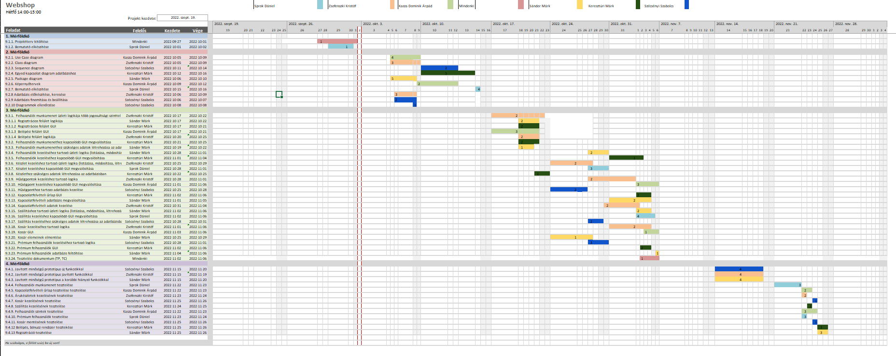

# Webshop Projektterv 2022

## 1. Összefoglaló 

A weboldal célja, hogy megkönnyitse a fogyasztó mindennapi életét, mivel elsőkézből elérheti a termékeket. Ehhez pedig a fogyasztónak semmit sem kell tennie, így elvégezheti a bevásárlást anélköl, hogy elhagyná a házát. Ehhez természetesen szükséges egy letisztult és egy mindenki számára könnyen értelmezhető és használahtó weboldal.

## 2. Verziók

| Verzió | Szerző(k)                | Dátum        | Státusz         | Megjegyzés                                                    |
|--------|--------------------------|--------------|-----------------|---------------------------------------------------------------|
| 0.1  | Sprok Dániel             | 2022-09-27 | Tervezet      | Legelső verzió, ötletelés                                             |
| 0.2  | Szécsényi Szabolcs, Sprok Dániel | 2022-10-02 | Előterjesztés | A projekt menedzser mindent jónak talált.                          |
| 1.0  | Sándor Márk               | 2022-10-09 | Elfogadott    | Kisebb módosítások elvégzése a projektben.                    |
| 1.1  | Kasza Dominik Árpád           | 2022-11-01 | Tervezet | Képernyőtervek.                      |
| 1.2  | Zsofenszki Kristóf           | 2022-11-04 | Tervezet | Gantt chart módosítása                      |
| 2.1  | Keresztúri Márk             | 2022-11-06 | Elfogadott    | Aprobb módosítások a leírásban.                |

Státusz osztályozás:
 - Tervezet: befejezetlen dokumentum, a mérföldkő leadása előtti napokban
 - Előterjesztés: a projekt menedzser bírálatával, a mérföldkő határidejekor
 - Elfogadott: a megrendelő által elfogadva, a prezentáció bemutatásakor

## 3. A projekt bemutatása

Ez a projektterv a Webshop projektet mutatja be, mely 2022-09-27-től 2022-11-27-ig tart. A projekt célja, hogy egy egyszerű felületet biztosítson azoknak akik a vásárlást inkább a házuk kényelméből szeretnék elvégezni. Ennek érdekében egy olyan webalkalmazást kell letrehoznunk, amit olyan felhasználók is könnyen használhatnak akik nem vagy csak nehezen értenek meg más nyelvet a magyarnál. Fontosnak tartom az idősebb generációra való gondolást is, mivel éppen ez az a réteg aki inkább otthonról akar vásárolni. A projekten hat fő fejlesztő fog dolgozni és az elvégzett feladatokat pedig négy alkalommal fogjuk prezentálni a megrendelőnek.

### 3.1. Rendszerspecifikáció

A weboldalnak képesnek kell lennie a biztonságos adat tárolásra és a tranzakciók lebonyolítására. Ezen felül a vásárló a megvásárolt termékekkel arányosan hűségpontokat kapjon.

### 3.2. Funkcionális követelmények

 - Munkamenet megvalosítás több szinten pl: admin, felhasználó, stb.
 - Árukészletek kezelése: hány darab maradt az adott termékből
 - Felhasználók kezelése
 - Egy regisztrációs felület új felhasználók számára
 - Egy belépési felület visszatérő felhasználók számára
 - Hűségpont rendszer
 - Szállítások kezelése
 - Kosár funkció
 - Kapcsolatfelvételi űrlap 
 

### 3.3. Nem funkcionális követelmények

 - Böngészőfüggetlenség
 - Reszponzív design
 - A privát adatok megfelelő tárolása és továbbadása

## 4. Költség- és erőforrás-szükségletek

Az erőforrásigényünk összesen kb. 20 személynap/fő.

A rendelkezésünkre áll összesen 6 * 70 = 420 pont.

## 5. Szervezeti felépítés és felelősségmegosztás
A projekt megrendelője Kertész Attila. A Webshop projektet a projektcsapat fogja végrehajtani, amely jelenleg hat fejlesztőből áll. A csapatban található egy tapasztalt webprogramozó is.
 - Szécsényi Szabolcs (2.5 év tapasztalat)
 - Keresztúri Márk (1 év tapasztalat)
 - Sándor Márk (1 év tapasztalat)
 - Sprok Dániel (<1 év tapasztalat)
 - Kasza Dominik Árpád (<1 év tapasztalat)
 - Zsofenszki Kristóf (<1 év tapasztalat)

### 5.1 Projektcsapat
A projekt a következő emberekből áll:

|                                                                                                                   | Név             | E-mail cím (stud-os)       |
|-------------------------------------------------------------------------------------------------------------------|-----------------|----------------------------|
| Megrendelő                                                                                                        | Kertész Attila | keratt@inf.u-szeged.hu  |
| Felelősségek: Projekt menedzser, Prezentációk, Gantt chart | Sprok Dániel    | h163942@stud.u-szeged.hu |
| Felelősségek: Hűségpont, árukészlet kezelése                                                            | Zsofenszki Kristóf    | h166567@stud.u-szeged.hu |
| Felelősségek: Felhasználói felületek, adatbázis                                                                    | Keresztúri Márk      | h046770@stud.u-szeged.hu |
| Felelősségek: árukészlet kezelése, kapcsolatfelvételi űrlap,                                               | Sándor Márk      | h052504@stud.u-szeged.hu |
| Felelősségek: képernyőtervek, GUI                                             | Kasza Dominik Árpád      | h159502@stud.u-szeged.hu |
| Felelősségek: regisztrációs felület, vásárlás megvalósítása                                              | Szécsényi Szabolcs      | h164681@stud.u-szeged.hu |

## 6. A munka feltételei

### 6.1. Munkakörnyezet
A projekt a következő munkaállomásokat fogja használni a munka során:
 - Munkaállomások: 5 db PC Windows 10-es operációs rendszerrel, 1 db IOS rendszerrel:
 - Asus Tuf F15 laptop (CPU: i5 10300H, RAM: 16GB, GPU: Nvidia GTX 1650 Ti)
 - Dell G5 5500 laptop (CPU: i5 10300H, RAM: 8 GB, GPU: Nvidia GTX 1650 Ti)
 - HP Laptop 15-db1xxx (CPU: Ryzen 5 3500U, RAM: 8 GB, GPU: Radeon Vega 8 Graphics)
 - LENOVO LEGION Y540 laptop (CPU: i5-9300HF, RAM: 8 GB, GPU:Geforce GTX 1650)`
 - Asztali számítógép (CPU: Ryzen 3600, RAM: 16GB, GPU: Radeon RX570)
 - Apple MacBook Pro (M1 Pro chip, CPU: 10-Core, RAM: 16GB, GPU: 16-Core)

A projekt a következő technológiákat/szoftvereket fogja használni a munka során: 
 - Heroku platformszolgáltatás
 - Heroku által biztosított PostgreSQL adatbázisszerver
 - DIA (tervezéshez)
 - Spring Boot (backend fejlesztéshez)
 - Node.js (frontend fejlesztéshez)
 - IntelliJ IDEA
 - Webstorm IDE
 - Git verziókövető (GitLab)

### 6.2. Rizikómenedzsment

| Kockázat                                    | Leírás                                                                                                                                                                                     | Valószínűség | Hatás  |
|---------------------------------------------|--------------------------------------------------------------------------------------------------------------------------------------------------------------------------------------------|--------------|--------|
| Betegség                                  | Súlyosságtól függően hátráltatja vagy bizonyos esetekben teljes mértékben korlátozza a munkavégzőt, így az egész projektre kihatással van. Megoldás: a feladatok átcsoportosítása        | nagy       | erős |
| Kommunikációs fennakadás a csapattagokkal | A csapattagok között nem elégséges az információ áramlás, nem pontosan, esetleg késve vagy nem egyértelműen tájékoztatjuk egymást. Megoldás: még gyakoribb megbeszélések és ellenőrzések | közepes        | erős |
| Informatika eszközök esetleges meghibásodása | Lehetséges olyan eset, hogy egy adott fejlesztő munkaeszköze ideiglegesen, vagy rosszabb esetben véglegesen meghibásodik. Megoldás: Ilyen esetben lehetőség van az Irínyi kabinetben található számítógépek használata. | kicsi        | közepes |

## 7. Jelentések

### 7.1. Munka menedzsment
A munkát Sprok Dániel koordinálja. Fő feladata, hogy folyamatosan egyeztessen a csapattagokkal az előrehaladásról és a fellépő problémákról, esetlegesen a megoldásban is segítséget nyújhat a projekt csúszásának elkerülése végett. További feladata a heti szinten tartandó csoportgyűlések időpontjának és helyszínének leszervezése, erről email-ben tájékoztatja a projektcsapatot.

### 7.2. Csoportgyűlések

A projekt körülbelül hetente ülésezik, hogy megvitassák az azt megelőző hét problémáit, illetve hogy megbeszéljék a következő hét feladatait. A megbeszélésről minden esetben memó készül.

1. megbeszélés:
 - Időpont: 2022.09.19.
 - Hely: SZTE Irinyi épület - Szeged, Tisza Lajos krt. 103
 - Résztvevők: Kasza Dominik Árpád, Keresztúri Márk, Sándor Márk, Zsofenszki Kristóf, Szécsényi Szabolcs (Sprok Dániel betegség miatt hiányzott)
 - Érintett témák: Ismerkedés, projekttéma kiválasztása

2. megbeszélés:
 - Időpont: 2022.09.26.
 - Hely: SZTE Irinyi épület - Szeged, Tisza Lajos krt. 103
 - Résztvevők: Kasza Dominik Árpád, Keresztúri Márk, Sándor Márk, Zsofenszki Kristóf, Szécsényi Szabolcs (Sprok Dániel betegség miatt hiányzott)
 - Érintett témák: A projektben használt technológiák (ismerkedés Git-tel) 
 
3. megbeszélés:
 - Időpont: 2022.09.28.
 - Hely: Privát Discord szerver
 - Résztvevők: Mindenki
 - Érintett témák: A dokumentáció felépítése, szerepkörök kiosztása, dokumentáció kisebb részekre felosztása.

4. Megbeszélés:
 - Időpont: 2022.09.30.
 - Hely: Privát Discord Szerver
 - Résztvevők: Mindenki
 - Érintett témák: Fontosabb módosítások a projekttervben.

5. Megbeszélés:
 - Időpont: 2022.10.01.
 - Hely: Privát Discord Szerver
 - Résztvevők: Kasza Dominik Árpád, Keresztúri Márk, Zsofenszki Kristóf, Sprok Dániel
 - Érintett témák: Részfeladatok meghatározása, feladatok kiosztása, Gannt-diagram 

6. Megbeszélés:
 - Időpont: 2022.10.16.
 - Hely: Privát Discord Megbeszélés
 - Résztvevők: Kasza Dominik Árpád, Sprok Dániel, Szécséni Szabolcs
 - Érintett témák: Sequence diagram és képernyőtervek megbeszélése, PPT befejezése
 - Váratlan probléma: Dominik lakásán elment az a áram képernyőtervek szerkesztése közben
 

### 7.3. Minőségbiztosítás

Az elkészült terveket a terveken nem dolgozó csapattársak közül átnézik, hogy megfelel-e a specifikációnak és az egyes diagramtípusok összhangban vannak-e egymással. A meglévő rendszerünk helyes működését a prototípusok bemutatása előtt a tesztelési dokumentumban leírtak végrehajtása alapján ellenőrizzük és összevetjük a specifikációval, hogy az elvárt eredményt kapjuk-e. További tesztelési lehetőségek: unit tesztek írása az egyes modulokhoz vagy a kód közös átnézése (code review) egy, a vizsgált modul programozásában nem résztvevő csapattaggal. Szoftverünk minőségét a végső leadás előtt javítani kell a rendszerünkre lefuttatott kódelemzés során kapott metrikaértékek és szabálysértések figyelembevételével.
Az alábbi lehetőségek vannak a szoftver megfelelő minőségének biztosítására:
- Specifikáció és tervek átnézése (kötelező)
- Teszttervek végrehajtása (kötelező)
- Unit tesztek írása (választható)
- Kód átnézése (választható)

### 7.4. Átadás, eredmények elfogadása

A projekt eredményeit Kertész Attila fogja elfogadni. A projektterven változásokat csak  Kertész Attila írásos kérés esetén Kertész Attila engedélyével lehet tenni. A projekt eredményesnek bizonyul, ha specifikáció helyes és határidőn belül készül el. Az esetleges késések pontlevonást eredményeznek.
Az elfogadás feltételeire és beadás formájára vonatkozó részletes leírás a következő honlapon olvasható: https://okt.sed.hu/rf1/

### 7.5. Státuszjelentés

Minden leadásnál a projektmenedzser jelentést tesz a projekt haladásáról, és ha szükséges változásokat indítványoz a projektterven. Ezen kívül a megrendelő felszólítására a menedzser 3 munkanapon belül köteles leadni a jelentést. A gyakorlatvezetővel folytatott csapatmegbeszéléseken a megadott sablon alapján emlékeztetőt készít a csapat, amit a következő megbeszélésen áttekintenek és felmérik az eredményeket és teendőket. Továbbá gazdálkodnak az erőforrásokkal és szükség esetén a megrendelővel egyeztetnek a projektterv módosításáról.

## 8. A munka tartalma

### 8.1. Tervezett szoftverfolyamat modell és architektúra

A szoftver fejlesztése során az SCRUM fejlesztési modellt alkalmazzuk. A fejlesztés során nagy hangsúlyt fektetünk a folyamatos kommunikációra. A fejlesztés során a szoftver specifikációi rugalmasan vátozhatnak, és ezzel a módszertannal tudunk a leggyorsabban alkalmazkodni az új elvárásokhoz.

A szoftver MVC alapú REST webszolgáltatásként működik. A szerver és a kliens függetlenek, csupán API végpontok segítségével kommunikálnak.

### 8.2. Átadandók és határidők
A főbb átadandók és határidők a projekt időtartama alatt a következők:

| Szállítandó |                 Neve                |   Határideje  |
|:-----------:|:-----------------------------------:|:-------------:|
|      D1     |       Projektterv és útmutató       | 2022-10-02  |
|    P1+D2    | UML, DB, képernyőtervek és bemutató | 2022-10-16  |
|    P1+D3    |      Prototípus I. és bemutató      | 2022-11-06  |
|    P2+D4    |      Prototípus II. és bemutató     | 2022-11-27  |

## 9. Feladatlista

A következőkben a tervezett feladatok részletes összefoglalása található.

### 9.1. Projektterv (1. mérföldkő)

Ennek a feladatnak az a célja, hogy megvalósításhoz szükséges lépéseket, az ütemzést és a felelősöket meghatározzuk.

Részfeladatai a következők:

#### 9.1.1. Projektterv kitöltése

Felelős: Mindenki

Tartam:  5 nap

Erőforrásigény:  1 személynap/fő

#### 9.1.2. Bemutató elkészítése

Felelős: Sprok Dániel

Tartam:  1 nap

Erőforrásigény:  1 személynap

### 9.2. UML és adatbázis tervek (2. mérföldkő)

Ennek a feladatnak az a célja, hogy a rendszerarchitektúrát, az adatbázist és webalkalmazás kinézetét megtervezzük.

Részfeladatai a következők:

#### 9.2.1. Use Case diagram

Felelős: Kasza Dominik Árpád

Tartam:  4 nap

Erőforrásigény:  4 személynap

#### 9.2.2. Class diagram

Felelős: Zsofenszki Kristóf

Tartam:  4 nap

Erőforrásigény:  3 személynap

#### 9.2.3. Sequence diagram

Felelős: Szécsényi Szabolcs

Tartam:  3 nap

Erőforrásigény:  2 személynap

#### 9.2.4. Egyed-kapcsolat diagram adatbázishoz

Felelős: Keresztúri Márk

Tartam:  5 nap

Erőforrásigény:  5 személynap

#### 9.2.5. Package diagram

Felelős: Sándor Márk

Tartam:  5 nap

Erőforrásigény:   5 személynap

#### 9.2.6. Képernyőtervek

Felelős: Kasza Dominik Árpád

Tartam:  3 nap

Erőforrásigény:  2 személynap

#### 9.2.7. Bemutató elkészítése, Gannt-diagram szerkesztés

Felelős: Sprok Dániel

Tartam:  4 nap

Erőforrásigény:  4 személynap

#### 9.2.8. Adatbázis előkészítése, keresése

Felelős: Zsofenszki Kristóf

Tartam:  3 nap

Erőforrásigény:  3 személynap

#### 9.2.9 Adatbázis finomítása és beállítása

Felelős: Szécsényi Szabolcs

Tartam: 2 nap

Erőforrásigény: 2 személynap

#### 9.2.10 Chart-ok ellenőrzése

Felelős: Szécsényi Szabolcs

Tartam: 1 nap

Erőforrásigény: 1 személynap

### 9.3. Prototípus I. (3. mérföldkő)

Ennek a feladatnak az a célja, hogy egy működő prototípust hozzunk létre, ahol a vállalt funkcionális követelmények nagy része már prezentálható állapotban van.

Részfeladatai a következők:

#### 9.3.1.  Felhasználói munkamenet üzleti logikája több jogosultsági szinttel (admin, felhasználó, premium)

Felelős: Zsofenszki Kristóf

Tartam:  5 nap

Erőforrásigény:  2 személynap

#### 9.3.1.1  Regisztrácios felület logikája

Felelős: Sándor Márk

Tartam:  5 nap

Erőforrásigény:  2 személynap

#### 9.3.1.2  Regisztrácios felület GUI

Felelős: Keresztúri Márk

Tartam:  4 nap

Erőforrásigény:  2 személynap

#### 9.3.1.3  Belépési felület GUI

Felelős: Kasza Dominik Árpád

Tartam:  4 nap

Erőforrásigény:  3 személynap

#### 9.3.1.4  Belépési felület logikája

Felelős: Zsofenszki Kristóf

Tartam:  5 nap

Erőforrásigény:  2 személynap

#### 9.3.2.  Felhasználói munkamenethez kapcsolódó GUI megvalósítása

Felelős: Keresztúri Márk

Tartam:  4 nap

Erőforrásigény:  2 személynap

#### 9.3.3.  Felhasználói munkamenethez szükséges adatok létrehozása az adatbázisban

Felelős: Sándor Márk

Tartam:  3 nap

Erőforrásigény:  1 személynap

#### 9.3.4.  Felhasználók kezeléséhez tartozó üzleti logika (listázása, módosítása, létrehozása, törlése)

Felelős: Sándor Márk

Tartam:  4 nap

Erőforrásigény:  2 személynap

#### 9.3.5.  Felhasználók kezeléséhez kapcsolódó GUI megvalósítása

Felelős: Keresztúri Márk

Tartam:  3 nap

Erőforrásigény:  1 személynap

#### 9.3.6.  Készlet kezeléshez tartozó üzleti logika (listázása, módosítása, létrehozása, törlése)

Felelős: Zsofenszki Kristóf

Tartam:  4 nap

Erőforrásigény:  2 személynap

#### 9.3.7.  Készlet kezeléshez kapcsolódó GUI megvalósítása

Felelős: Sprok Dániel

Tartam:  4 nap

Erőforrásigény:  3 személynap

#### 9.3.8.  Készlethez szükséges adatok létrehozása az adatbázisban

Felelős: Keresztúri Márk

Tartam:  3 nap

Erőforrásigény:  1 személynap

#### 9.3.9.  Hűségpontok kezeléshez tartozó logika

Felelős: Zsofenszki Kristóf

Tartam:  4 nap

Erőforrásigény:  2 személynap

#### 9.3.10.  Hűségpont kezeléshez kapcsolódó GUI megvalósítása

Felelős: Kasza Dominik Árpád

Tartam:  5 nap

Erőforrásigény:  3 személynap

#### 9.3.11.  Hűségponthoz tartozo adatbázis kezelése

Felelős: Szécsényi Szabolcs

Tartam:  3 nap

Erőforrásigény:  2 személynap

#### 9.3.12.  Kapcsolatfelvételi űrlap GUI

Felelős: Keresztúri Márk

Tartam:  4 nap

Erőforrásigény:  2 személynap

#### 9.3.13.  Kapcsolatfelvételi adatbázis megvalosítása

Felelős: Sándor Márk

Tartam:  4
 nap

Erőforrásigény:  2 személynap

#### 9.3.14.  Kapcsolatfelvételi adatok kezelése

Felelős: Zsofenszki Kristóf

Tartam:  4 nap

Erőforrásigény:  2 személynap

#### 9.3.15.  Szállításhoz tartozó üzleti logika (listázása, módosítása, létrehozása, törlése)

Felelős: Sándor Márk

Tartam:  4 nap

Erőforrásigény:  2 személynap

#### 9.3.16.  Szállítás kezeléshez kapcsolódó GUI megvalósítása

Felelős: Sprok Dániel

Tartam:  4 nap

Erőforrásigény:  4 személynap

#### 9.3.17.  Szállítás kezeléséhez szükséges adatok létrehozása az adatbázisban

Felelős: Szécsényi Szabolcs

Tartam:  3 nap

Erőforrásigény:  2 személynap

#### 9.3.18.  Kosár kezeléséhez tartozó logika

Felelős: Zsofenszki Kristóf

Tartam:  5 nap

Erőforrásigény:  2 személynap

#### 9.3.19.  Kosár GUI

Felelős: Kasza Dominik Árpád

Tartam:  3 nap

Erőforrásigény:  1 személynap

#### 9.3.20.  Kosár elemeinek elmentése

Felelős: Sándor Márk

Tartam:  4 nap

Erőforrásigény:  1 személynap

#### 9.3.21.  Prémium felhasználók kezeléséhez tartozó logika

Felelős: Szécsényi Szabolcs

Tartam:  4 nap

Erőforrásigény:  3 személynap

#### 9.3.22.  Prémium felhasználók GUI

Felelős: Keresztúri Márk

Tartam:  4 nap

Erőforrásigény:  2 személynap

#### 9.3.23.  Prémium felhasználók adatbázis feltöltése

Felelős: Sándor Márk

Tartam:  2 nap

Erőforrásigény:  1 személynap

#### 9.3.24. Tesztelési dokumentum 

Felelős: Mindenki

Tartam:  4 nap

Erőforrásigény:  1 személynap/fő

### 9.4. Prototípus II. (4. mérföldkő)

Ennek a feladatnak az a célja, hogy az előző mérföldkő hiányzó funkcióit pótoljuk, illetve a hibásan működő funkciókat és az esetlegesen felmerülő új funkciókat megvalósítsuk. Továbbá az alkalmazás tesztelése is ebben a mérföldkőben történik.

Részfeladatai a következők:

#### 9.4.1. Javított minőségű prototípus új funkciókkal

Felelős: Szécsényi Szabolcs

Tartam:  5 nap

Erőforrásigény:  4 személynap

#### 9.4.2. Javított minőségű prototípus javított funkciókkal

Felelős: Zsofenszki Kristóf

Tartam:  6 nap

Erőforrásigény:  4 személynap

#### 9.4.3. Javított minőségű prototípus a korábbi hiányzó funkciókkal

Felelős: Sándor Márk

Tartam:  5 nap

Erőforrásigény:  4 személynap

#### 9.4.4. Felhasználói munkamenet tesztelése 

Felelős: Sprok Dániel

Tartam:  2 nap

Erőforrásigény:  3 személynap

#### 9.4.5.  Kapcsolatfelvételi űrlap tesztelése 

Felelős: Kasza Dominik Árpád

Tartam:  2 nap

Erőforrásigény:  2 személynap

#### 9.4.6. Árukészletek kezelésének tesztelése 

Felelős: Zsofenszki Kristóf

Tartam:  2 nap

Erőforrásigény:  2 személynap

#### 9.4.7. Kosár kezelésének tesztelése

Felelős: Szécsényi Szabolcs

Tartam:  1 nap

Erőforrásigény: 1 személynap

#### 9.4.8. Szállítás kezelésének tesztelése

Felelős: Keresztúri Márk

Tartam:  1 nap

Erőforrásigény:  2 személynap

#### 9.4.9. Felhasználói szintek tesztelése

Felelős: Kasza Dominik Árpád

Tartam:  3 nap

Erőforrásigény:  3 személynap

#### 9.4.10. Prémium felhasználók tesztelése

Felelős: Sprok Dániel

Tartam:  2 nap

Erőforrásigény:  3 személynap

#### 9.4.11. Kosár mentésének tesztelése

Felelős: Szécsényi Szabolcs

Tartam:  1 nap

Erőforrásigény:  1 személynap

#### 9.4.12. Belépés, bónusz rendszer tesztelése

Felelős: Keresztúri Márk

Tartam:  2 nap

Erőforrásigény:  3 személynap

#### 9.4.13. Regisztráció tesztelése

Felelős: Sándor Márk

Tartam:  2 nap

Erőforrásigény:  3 személynap

## 10. Részletes időbeosztás

## 11. Projekt költségvetés

### 11.1. Részletes erőforrásigény (személynap)

|                     Név                    | 1. leadás - Projektterv | 2. leadás - UML és adatbázis | 3. leadás - Prototípus I. | 4. leadás - Prototípus II. | Összesen |
|:------------------------------------------:|:----------------------:|:--------------------------:|:-----------------------:|:------------------------:|:---------:|
|                     Zsofenszki Kristóf           |           1         |             6            |          13         |            6           |    26 |
|                     Keresztúri Márk           |           1          |             5            |           11          |            5          |     22 |
|                     Sándor Márk             |           1         |             5         |           13          |            7           |      26   |
|                     Sprok Dániel            |           2          |             4           |           8         |            6         |       20     |
|                     Kasza Dominik Árpád            |           1          |             6             |           8         |           5         |   20  |
|                     Szécsényi Szabolcs             |           1          |             5           |           8         |            6          |  20     |

### 11.2. Részletes feladatszámok

|                     Név                    | 1. leadás - Projektterv | 2. leadás - UML és adatbázis | 3. leadás - Prototípus I. | 4. leadás - Prototípus II. | Összesen |
|:------------------------------------------:|:----------------------:|:--------------------------:|:-----------------------:|:------------------------:|:---------:|
|                     Zsofenszki Kristóf           |           1          |             2            |           7           |            2           |    12   |
|                     Keresztúri Márk           |           1          |             1            |           7           |            2           |    11   |
|                     Sándor Márk             |           1          |             1            |           8           |            2           |    12   |
|                     Sprok Dániel            |           1          |             1            |           4          |            2           |    8   |
|                     Kasza Dominik Árpád            |           1          |             2            |           4          |            2           |    9   |
|                     Szécsényi Szabolcs             |           1          |             3            |           4          |            3           |    11   |

### 11.3. Részletes költségvetés

|                     Név                       | 1. leadás - Projektterv | 2. leadás - UML és adatbázis | 3. leadás - Prototípus I. | 4. leadás - Prototípus II. | Összesen |
|:---------------------------------------------:|:----------------------:|:--------------------------:|:-----------------------:|:------------------------:|:---------:|
|        Maximálisan választható pontszám %-ban |         10% (7)        |            30% (21)        |          50% (35)       |          30% (21)        | 100% (70) |
|                     Zsofenszki Kristóf              |          3          |             16           |               35      |            16          |    70   |
|                     Keresztúri Márk              |           3          |             16           |                35     |            16          |    70   |
|                     Sándor Márk                |           3          |            	13           |          	35           |         19          |    70   |
|                     Sprok Dániel            |           7          |             		14            |           28          |            21           |    70   |
|                     Kasza Dominik Árpád            |           4          |           21             |           28          |           17           |    70   |
|                     Szécsényi Szabolcs             |          4         |             17            |             28        |            21          |    70   |

Szeged, 2022-10-02.
